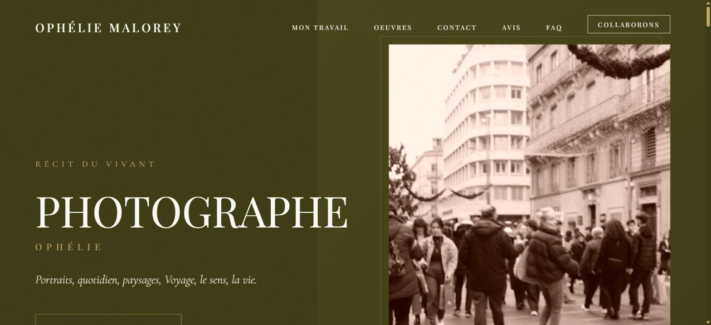
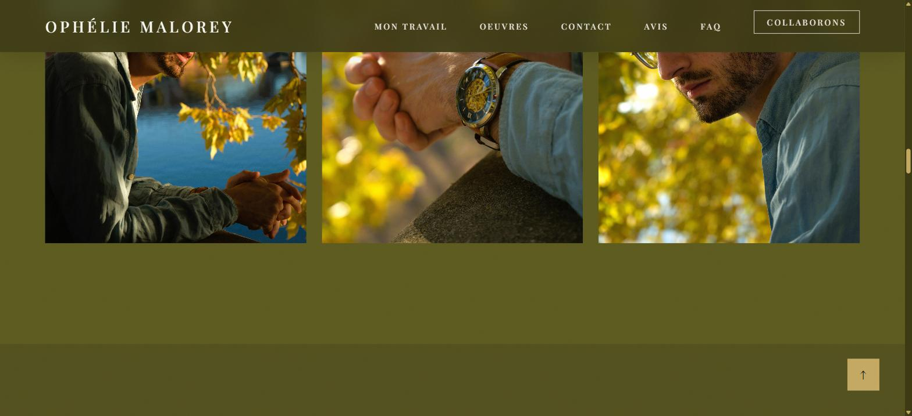

# 📷 Ophélie Malorey, Photographe

[](https://github.com/BnRomain/ophelie-malorey-photographe/actions/workflows/ci.yml)
[](https://github.com/BnRomain/ophelie-malorey-photographe/actions/workflows/github-code-scanning/codeql)
[](https://github.com/BnRomain/ophelie-malorey-photographe/releases)
[](LICENSE)
[](https://bnromain.github.io/ophelie-malorey-photographe/)


The portfolio website of **Ophélie Malorey**, photographer in Toulouse: portraits, everyday life, landscapes and travel. A one-page site built from her PDF mockup in **vanilla HTML, CSS and JavaScript**, with no framework and no build step, served as is by GitHub Pages.

Beyond the design, the site carries a complete **SEO and GEO** layer (generative engine optimization, so that search engines *and* AI assistants describe the photographer correctly): a JSON-LD graph, a visible FAQ synchronized with its schema, a sitemap with images, `llms.txt` and machine-readable entity files.

| Context | Client | Design and development |
| --- | --- | --- |
| Freelance project delivered under the [OptimizIA.xyz](https://www.optimizia.xyz) brand, February to June 2025 | Ophélie Malorey, photographer, Toulouse (Occitanie) | Romain Ben |

🌐 **Live site:** [bnromain.github.io/ophelie-malorey-photographe](https://bnromain.github.io/ophelie-malorey-photographe/)

## 📸 Preview

| Hero section | "Oeuvres et travaux" gallery |
| --- | --- |
|  |  |

## 🎯 The Brief

Ophélie needed a showcase that stays faithful to her mockup, elegant and editorial, and that works on a phone as well as on a desktop. The constraints, kept in the original brief ([`docs/cahier-des-charges-fr.md`](docs/cahier-des-charges-fr.md), in French), shaped the code:

- semantic HTML, a descriptive `alt` on every photograph, keyboard navigation;
- mobile-first CSS with custom properties, no CSS framework;
- vanilla JavaScript used only for progressive enhancement: the site is complete and usable without it;
- performance: lazy loading, images resized for the web, no third-party script;
- French content, olive and gold palette, serif typography (Cormorant Garamond and Playfair Display).

## 🛠️ How It Works

| File | Role |
| --- | --- |
| `index.html` | The seven sections in the order of the mockup: hero, "Mon travail", "Oeuvres et travaux" (three photo sessions), call to action, contact, testimonials and FAQ. The `<head>` holds the metadata (canonical URL, Open Graph, Twitter card, geo tags) and the JSON-LD graph |
| `mentions-legales.html` | Legal notice: publisher, hosting, intellectual property, personal data (GDPR), cookies, credits |
| `css/style.css` | The whole design: custom properties, mobile-first media queries, grain overlay, gold frames around the photographs, reveal and typing animations, lightbox, all disabled under `prefers-reduced-motion` |
| `js/main.js` | Smart navbar (transparent at the top, hidden while scrolling down), hamburger menu, reveal on scroll with `IntersectionObserver` and a stagger effect, typing effect on the title, parallax on the hero image, lightbox with previous and next, keyboard arrows, Escape and a focus trap, back-to-top button |
| `assets/images/` | The 17 photographs served by the site, named after the section they illustrate, resized to 2000 px at most and encoded as progressive JPEG (5.1 MB in total, down from 44 MB of camera files) |
| `sitemap.xml`, `robots.txt`, `llms.txt`, `entities.json`, `ai-index.json`, `humans.txt`, `manifest.json`, `favicon.svg` | The machine-readable layer: sitemap with the featured images, crawlers allowed (including the AI ones), a summary of the photographer for language models, structured entities, the PWA manifest and a monogram favicon |
| `scripts/check-site.mjs` | The consistency check run by the CI (see [Tests and Quality](#-tests-and-quality)) |

### SEO and GEO

- **Structured data**: a JSON-LD `@graph` with `LocalBusiness` and `ProfessionalService` (address, area served, services offered, social profiles), `Person`, `WebSite` and `FAQPage`.
- **Visible FAQ** (five questions in an accordion) with the same answers as the schema: where she shoots, what she offers, weddings, pricing on quotation, how to book.
- **One site URL everywhere**: canonical, Open Graph, JSON-LD, sitemap, `robots.txt`, `llms.txt` and the entity files all point to the GitHub Pages URL. The CI fails on any other URL.
- **Calibrated metadata**: a title of about 60 characters with the keywords, a description, a real Open Graph image, `max-image-preview:large`, geo tags for Toulouse.
- Measured with the RoastMyUrl audit in June 2026: from 67 to 79 out of 100 after this pass.

Known limit: the site is a GitHub Pages *project* site, served under a path. Crawlers only read `robots.txt` and `sitemap.xml` at the root of a domain, so these two files are best-effort until the site gets a custom domain.

## 🚀 Getting Started

The site is static: open `index.html` in a browser, or serve the folder to get the same behaviour as GitHub Pages. Node.js 22 is only needed for the linters and the site check.

```bash
git clone https://github.com/BnRomain/ophelie-malorey-photographe.git
cd ophelie-malorey-photographe
python -m http.server 8000      # then open http://localhost:8000/

npm ci
npm run lint                    # html-validate, stylelint and ESLint
npm run check                   # JSON, JSON-LD, sitemap, referenced files, site URL and image budget
```

Merging to `main` deploys the site on GitHub Pages.

## 🗂️ Repository Structure

```text
ophelie-malorey-photographe/
├── index.html                    the one-page site
├── mentions-legales.html         legal notice
├── css/style.css                 design, animations, responsive layout
├── js/main.js                    interactions (progressive enhancement)
├── assets/images/                the 17 photographs served by the site
├── sitemap.xml, robots.txt       crawling
├── llms.txt, entities.json,      machine-readable layer for search engines
│   ai-index.json, humans.txt     and AI assistants
├── manifest.json, favicon.svg    PWA manifest and monogram favicon
├── scripts/check-site.mjs        consistency check of the site (npm run check)
├── docs/
│   ├── cahier-des-charges-fr.md  the brief (French)
│   ├── ameliorations-fr.md       what was added on top of the mockup (French)
│   └── screenshot-*.jpg          the screenshots of this README
├── .github/                      workflows, issue and pull request templates, Dependabot
├── package.json                  linters (pinned versions), no runtime dependency
├── .htmlvalidate.json, .stylelintrc.json, eslint.config.js
├── CODE_OF_CONDUCT.md            code of conduct
├── CONTRIBUTING.md               contributing guide
├── LICENSE                       MIT License (code only)
└── SECURITY.md                   security policy
```

## ✅ Tests and Quality

On every pull request and every push to `main`, GitHub Actions runs:

- **lint**: html-validate on the two pages, stylelint on the stylesheet and ESLint on the scripts;
- **site**: `scripts/check-site.mjs` checks that the JSON files and the JSON-LD parse, that the sitemap is well formed and only lists files of the repository, that every image, stylesheet and script referenced by the pages exists, that a single site URL is used, and that every image stays under 700 kB. The page weight goes to the job summary;
- **docs**: markdownlint, then lychee checks the links, heading anchors and images of the Markdown and HTML files;
- **Dependency review**: blocks a pull request that adds a vulnerable dependency;
- **CodeQL**: security analysis of the JavaScript and the workflows.

The `main` branch is protected: every change goes through a pull request and can only be merged once these checks pass. Secret scanning with push protection blocks any committed credential.

Versions follow [Semantic Versioning](https://semver.org/) and are published as [GitHub releases](https://github.com/BnRomain/ophelie-malorey-photographe/releases): see the [contributing guide](CONTRIBUTING.md#versioning-and-releases).

**Dependabot** monitors the development tools and the GitHub Actions. Patch and minor updates are merged automatically once the required checks of `main` have passed. See also the [security policy](SECURITY.md) and the [wiki](https://github.com/BnRomain/ophelie-malorey-photographe/wiki).

## 📄 Documentation

The project documents are in French:

- **📝 The brief**, extracted from the mockup: sections, palette, typography, coding rules: [`docs/cahier-des-charges-fr.md`](docs/cahier-des-charges-fr.md)
- **✨ What was added** on top of the mockup: design details, animations, lightbox, accessibility, performance: [`docs/ameliorations-fr.md`](docs/ameliorations-fr.md)

## 🙏 Acknowledgments

- Ophélie Malorey, for her trust and her photographs. Follow her work on [Instagram](https://www.instagram.com/ophe_les_photos/).
- [Google Fonts](https://fonts.google.com/) for Cormorant Garamond and Playfair Display.
- [html-validate](https://html-validate.org/), [stylelint](https://stylelint.io/) and [ESLint](https://eslint.org/), the only dependencies of the project, used in development only.

## 🤝 Contributing

Contributions are welcome. Please read the [contributing guide](CONTRIBUTING.md) and the [code of conduct](CODE_OF_CONDUCT.md) before opening an issue or a pull request. Security vulnerabilities must be reported privately, as described in the [security policy](SECURITY.md).

## 📜 License

The source code is released under the [MIT License](LICENSE). The photographs of `assets/images/` and the texts of the pages are the property of Ophélie Malorey, all rights reserved: they may not be reused without her written consent.
